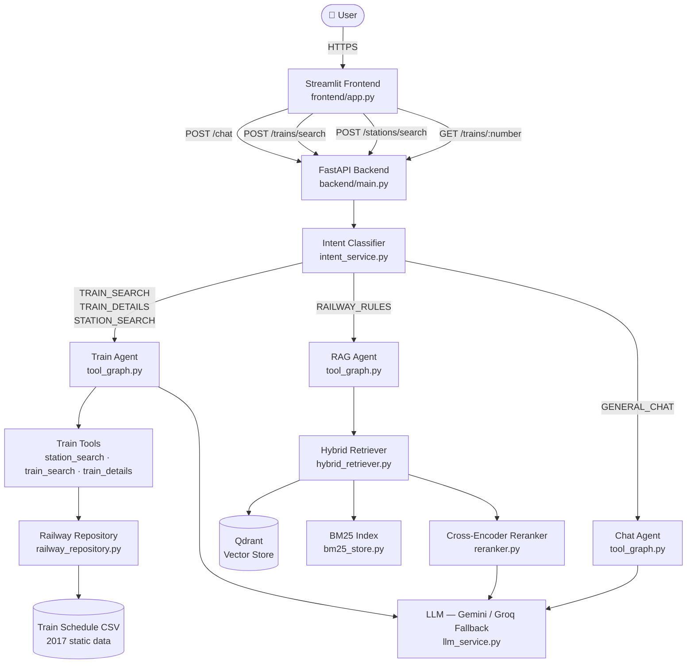
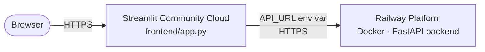
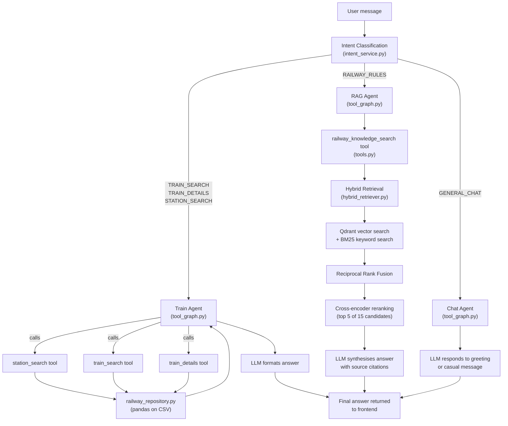

# 🚆 AI Indian Rail Travel Assistant

> An AI-powered assistant for Indian Railways — search trains, look up routes, and get answers to railway rules and policies through a conversational interface.

---

## Table of Contents

1. [Overview](#overview)
2. [Problem Statement](#problem-statement)
3. [Key Features](#key-features)
4. [System Architecture](#system-architecture)
5. [Tech Stack](#tech-stack)
6. [AI & RAG Pipeline](#ai--rag-pipeline)
7. [API Reference](#api-reference)
8. [Project Structure](#project-structure)
9. [Local Setup](#local-setup)
10. [Deployment](#deployment)
11. [Configuration](#configuration)
12. [Security & Repository Hygiene](#security--repository-hygiene)
13. [Limitations & Future Improvements](#limitations--future-improvements)

---

## Overview

AI Indian Rail Travel Assistant is a full-stack application that helps users interact with Indian Railways information through two complementary interfaces:

- **A structured train search form** — enter an origin, destination, and preference (fastest / shortest distance / balanced) to get a ranked list of trains with departure times, arrival times, and journey duration.
- **A conversational AI chat assistant** — ask natural-language questions about trains, routes, or official railway policies and receive grounded, contextual answers.

The backend is a FastAPI service; the frontend is a Streamlit web application. The two are deployed independently and communicate over HTTP.

---

## Problem Statement

Railway information in India is spread across multiple sources — timetables, IRCTC documents, FAQs, and rule books — making it time-consuming to find answers to common questions such as:

- Which trains run between two cities, and which is the fastest?
- What is the Tatkal booking fee and cut-off time?
- What are the cancellation and refund rules?
- What luggage is allowed, and what concessions are available?
- What documents are needed when travelling by train?

This project provides a unified, AI-assisted interface that combines a static train schedule dataset with a retrieval-augmented generation (RAG) pipeline over official IRCTC and Indian Railways documents, so users can get structured results and grounded answers in one place.

---

## Key Features

| Feature | Description |
|---|---|
| **Train search** | Search direct trains between any two cities or station codes. Returns departure time, arrival time, journey duration, and distance for each train. |
| **Train ranking** | Results can be sorted by fastest, shortest distance, or a balanced score combining both. A single recommended train is always highlighted. |
| **Station search** | Resolve a city or partial station name to matching station codes from the timetable dataset. |
| **Train route / stops** | Retrieve the full ordered stop list for any train number. |
| **Conversational AI assistant** | Multi-turn chat backed by a LangGraph agent. Maintains conversation memory within a session. |
| **Intent detection & routing** | Every user message is classified into one of five intents (train search, train details, station search, railway rules, or general chat) before routing to the correct agent. |
| **RAG over official documents** | Policy questions are answered using hybrid retrieval over six official IRCTC and Indian Railways PDF documents, followed by cross-encoder reranking and an LLM synthesis step. |
| **Hybrid retrieval** | Combines dense vector search (Qdrant + BAAI/bge-small-en-v1.5) and BM25 keyword search using Reciprocal Rank Fusion (RRF). |
| **Reranking** | A `cross-encoder/ms-marco-MiniLM-L6-v2` cross-encoder reranks the 15 hybrid candidates to the top 5 most relevant chunks before passing context to the LLM. |
| **LLM fallback** | Uses Gemini as the primary LLM. Automatically falls back to Groq (LLaMA 3.1) when Gemini hits a quota limit. |
| **Source citations** | RAG answers include source document names and page numbers so users can verify information. |

---

## System Architecture

### Application Flow



### Deployment Architecture



- The **Streamlit frontend** is deployed on Streamlit Community Cloud.
- The **FastAPI backend** is deployed on Railway using the provided `Dockerfile`.
- The frontend communicates with the backend exclusively via the `API_URL` environment variable / Streamlit secret.
- All API keys (`GEMINI_API_KEY`, `GROQ_API_KEY`) live only in the backend's Railway environment — they are never exposed to or stored in the frontend.

---

## Tech Stack

### Frontend

| Technology | Purpose |
|---|---|
| **Streamlit** | Web UI framework — chat interface, train search form, card rendering |
| **requests** | HTTP client for calling the FastAPI backend |

### Backend

| Technology | Purpose |
|---|---|
| **Python 3.11** | Runtime (as specified in Dockerfile) |
| **FastAPI** | REST API framework |
| **Uvicorn** | ASGI server (standard extras) |
| **Pydantic / pydantic-settings** | Request/response validation and typed settings from `.env` |
| **python-dotenv** | Loads `.env` into environment on local runs |
| **pandas** | In-memory train schedule dataset loading and querying |

### AI / LLM

| Technology | Purpose |
|---|---|
| **Google Gemini** (`google-genai`, `langchain-google-genai`) | Primary LLM for chat, intent classification, and RAG answer synthesis |
| **Groq / LLaMA 3.1** (`langchain-groq`) | Automatic fallback LLM when Gemini hits quota limits |
| **LangChain** (`langchain`, `langchain-core`, `langchain-community`) | Prompt building, tool definitions, document loaders |
| **LangGraph** (`langgraph`) | Multi-agent graph orchestration with in-memory conversation checkpointing |

### Retrieval / RAG

| Technology | Purpose |
|---|---|
| **Qdrant** (`qdrant-client`) | Local on-disk vector store for dense document retrieval |
| **BAAI/bge-small-en-v1.5** (`sentence-transformers`) | Embedding model used for both ingestion and query encoding |
| **BM25Okapi** (`rank-bm25`) | Keyword-based retrieval using BM25 scoring |
| **Reciprocal Rank Fusion** | Custom implementation merging vector and BM25 result lists |
| **cross-encoder/ms-marco-MiniLM-L6-v2** (`sentence-transformers`) | Cross-encoder reranker that rescores the top 15 hybrid candidates |
| **PyPDF** (`pypdf`) | PDF loading during document ingestion |
| **LangChain text splitters** | Recursive character text splitting during ingestion |

### Data

| Source | Description |
|---|---|
| `data/railway/Train_details_22122017.csv` | Static Indian Railways timetable from December 2017. Contains train numbers, names, station codes, sequence numbers, arrival/departure times, and cumulative distances (~16 MB). |
| `backend/rag/documents/*.pdf` | Six official PDFs: IRCTC e-ticket FAQ, IRCTC terms and conditions, cancellation & refund rules, luggage rules, concession rules, and Tatkal FAQ. |
| `backend/rag/chunks.jsonl` | Pre-processed and chunked text extracted from the PDFs, stored as JSON Lines. Used to build both the Qdrant vector store and the BM25 index. |

### Deployment

| Technology | Purpose |
|---|---|
| **Docker** | Containerises the FastAPI backend (`python:3.11-slim` base image) |
| **Railway** | Cloud platform hosting the backend container |
| **Streamlit Community Cloud** | Hosts the frontend application |

---

## AI & RAG Pipeline

### How the chat assistant works

Every message sent to `POST /chat` is processed by a **LangGraph multi-agent graph** (`tool_graph.py`). Here is the full flow:



### Component explanations

**Intent detection** (`intent_service.py`)  
Before any tool is called, the user's latest message — together with the full conversation history — is passed to the LLM configured with structured output (`UserIntent`). The LLM classifies the intent into one of five categories. This allows the graph to route the message to exactly the right agent rather than blindly invoking all tools every time.

**Train Agent** (`tool_graph.py → train_agent`)  
Handles train search, train details, and station lookup. The LLM is bound to three LangChain tools: `station_search`, `train_search`, and `train_details`. It decides which tools to call based on the user's message. The LangGraph loop allows it to call tools, receive results, and continue reasoning until a final answer is ready. The agent follows a strict system prompt that prohibits inventing trains or schedules.

**Railway tools** (`tools.py` + `train_service.py` + `railway_repository.py`)  
- `station_search`: queries the CSV dataset for stations matching a city name or station code.
- `train_search`: resolves origin and destination to station codes, then finds direct trains by joining the dataset on `Train No` and filtering for correct sequence order.
- `train_details`: returns all stops of a specific train number in order.
- Train results are ranked by the `train_ranker.py` according to the user's preference (`fastest`, `shortest_distance`, or `balanced`).
- Duration calculation handles overnight journeys that cross midnight (`time_utils.py`).

**RAG Agent** (`tool_graph.py → rag_agent`)  
For policy and rules questions, the agent directly calls `railway_knowledge_search` without an LLM decision loop, saving an API call and preventing the agent from getting into an infinite loop.

**RAG pipeline** (`rag/`)  
1. **Hybrid retrieval** (`hybrid_retriever.py`): runs the query through both Qdrant (dense vector search using `BAAI/bge-small-en-v1.5` embeddings) and BM25 (keyword search using `BM25Okapi`). Results are merged using **Reciprocal Rank Fusion** — a score fusion technique that rewards documents ranked highly by both methods.
2. **Reranking** (`reranker.py`): the top 15 fused candidates are passed to a `cross-encoder/ms-marco-MiniLM-L6-v2` cross-encoder, which scores each `(query, chunk)` pair directly. The top 5 are selected.
3. **Answer synthesis** (`rag_service.py`): the 5 reranked chunks are assembled into a context prompt and sent to the LLM with a strict system prompt that prohibits inventing information. The final answer includes source document names and page numbers.

**LLM fallback** (`llm_service.py`)  
The `FallbackLLM` wrapper tries Gemini first. On any `429 / RESOURCE_EXHAUSTED / quota` error, it transparently retries with the Groq/LLaMA fallback. The fallback applies to `.invoke()`, `.bind_tools()`, and `.with_structured_output()`, making it a seamless drop-in replacement.

**Conversation memory**  
LangGraph's `MemorySaver` checkpointer stores the conversation message list in memory, keyed by `thread_id`. Each browser session gets a unique UUID thread. Memory is not persisted to disk — it resets when the backend restarts.

---

## API Reference

The FastAPI backend exposes the following endpoints. Interactive Swagger documentation is available at `/docs` when the server is running.

### Endpoint summary

| Method | Endpoint | Purpose |
|---|---|---|
| `GET` | `/` | Root — returns app name, version, and status |
| `GET` | `/health` | Health check |
| `POST` | `/stations/search` | Find stations matching a name or code |
| `POST` | `/trains/search` | Search direct trains between two locations |
| `GET` | `/trains/{train_number}` | Get full stop list for a train |
| `POST` | `/chat` | Send a message to the conversational AI assistant |

---

### `GET /`

Returns basic application metadata.

**Example response**
```json
{
  "message": "AI Indian Rail Travel Assistant",
  "version": "1.0.0",
  "status": "running"
}
```

---

### `GET /health`

Lightweight health check used by deployment platforms.

**Example response**
```json
{ "status": "healthy" }
```

---

### `POST /stations/search`

Find railway stations whose name or code matches the query string.

**Request body**
```json
{ "query": "Hyderabad" }
```

| Field | Type | Required | Description |
|---|---|---|---|
| `query` | string | Yes | City name, station name, or station code |

**Example response**
```json
{
  "query": "Hyderabad",
  "count": 3,
  "stations": [
    { "Station Code": "HYB", "Station Name": "HYDERABAD DECCAN" },
    { "Station Code": "SC",  "Station Name": "SECUNDERABAD JN" },
    { "Station Code": "NZB", "Station Name": "NIZAMABAD" }
  ]
}
```

---

### `POST /trains/search`

Search for direct trains between two cities or station codes.

**Request body**
```json
{
  "origin": "Hyderabad",
  "destination": "Chennai",
  "preference": "balanced"
}
```

| Field | Type | Required | Default | Description |
|---|---|---|---|---|
| `origin` | string | Yes | — | Origin city name or station code |
| `destination` | string | Yes | — | Destination city name or station code |
| `preference` | string | No | `"balanced"` | Ranking preference: `"balanced"`, `"fastest"`, or `"shortest_distance"` |

**Example response**
```json
{
  "origin": "Hyderabad",
  "destination": "Chennai",
  "preference": "balanced",
  "count": 4,
  "trains": [
    {
      "train_number": "12759",
      "train_name": "CHARMINAR EXP",
      "origin_code": "HYB",
      "origin_name": "HYDERABAD DECCAN",
      "destination_code": "MAS",
      "destination_name": "CHENNAI CENTRAL",
      "departure_time": "18:10:00",
      "arrival_time": "06:10:00",
      "duration_minutes": 720,
      "duration": "12h",
      "distance_km": 794.0,
      "source": "static_schedule_2017"
    }
  ],
  "recommended_train": { "...": "same shape as above" },
  "reason": "Best overall balance of speed and distance.",
  "ranking_preference": "balanced"
}
```

> **Note:** Schedule data is from December 2017. Always verify on IRCTC before booking.

---

### `GET /trains/{train_number}`

Returns the full, ordered list of stops for a given train.

**Path parameter:** `train_number` — numeric train number (e.g. `12759`)

**Example response**
```json
{
  "train_number": "12759",
  "stop_count": 18,
  "route": [
    {
      "Train No": "12759",
      "Train Name": "CHARMINAR EXP",
      "SEQ": 1,
      "Station Code": "HYB",
      "Station Name": "HYDERABAD DECCAN",
      "Arrival time": "Source",
      "Departure Time": "18:10:00",
      "Distance": "0"
    },
    { "...": "..." }
  ]
}
```

---

### `POST /chat`

Send a message to the AI assistant. The assistant maintains per-session conversation history using `thread_id`.

**Request body**
```json
{
  "message": "What are the Tatkal booking rules?",
  "thread_id": "abc123"
}
```

| Field | Type | Required | Default | Description |
|---|---|---|---|---|
| `message` | string | Yes | — | User's message |
| `thread_id` | string | No | `"default"` | Session identifier for conversation continuity |

**Example response**
```json
{
  "message": "What are the Tatkal booking rules?",
  "response": "Tatkal booking opens 1 day before the date of journey (excluding the date of journey)...\n\n📚 Sources\n• irctc_tatkal_faq.pdf — Page 3\n",
  "thread_id": "abc123"
}
```

> Swagger UI is available at `http://localhost:8000/docs` when the backend is running locally.

---

## Project Structure

```
AI-Indian-Rail-Travel-Assistant/
├── backend/
│   ├── main.py                  # FastAPI app — all route definitions
│   ├── config.py                # Typed settings (Pydantic) — loads from .env
│   ├── chat_service.py          # Entry point for /chat — invokes LangGraph with timeout
│   ├── tool_graph.py            # LangGraph multi-agent graph (intent → routing → agents)
│   ├── graph.py                 # Earlier single-path travel graph (not used by /chat)
│   ├── intent_service.py        # LLM-based intent classification into 5 categories
│   ├── llm_service.py           # Gemini + Groq fallback wrapper (FallbackLLM)
│   ├── tools.py                 # LangChain @tool definitions: station_search, train_search,
│   │                            #   train_details, railway_knowledge_search
│   ├── train_service.py         # High-level train search helpers used by tools and routes
│   ├── train_ranker.py          # Sorts and recommends trains by preference
│   ├── railway_repository.py    # pandas-based data access layer over the CSV dataset
│   ├── data_loader.py           # Reads and parses the train schedule CSV
│   ├── time_utils.py            # Duration calculation (handles overnight journeys)
│   ├── format_utils.py          # Formats minutes into human-readable "2h 35m"
│   ├── models.py                # Pydantic models: TrainStop, TrainSearchResult,
│   │                            #   TravelIntent, ChatIntent, UserIntent
│   ├── list_models.py           # Utility script to list available Gemini models
│   └── rag/
│       ├── ingest.py            # One-time script: load PDFs → chunk → write chunks.jsonl
│       ├── vector_store.py      # One-time script: embed chunks.jsonl → Qdrant collection
│       ├── bm25_store.py        # Loads chunks.jsonl and builds an in-memory BM25 index
│       ├── retriever.py         # Dense vector retrieval via Qdrant
│       ├── hybrid_retriever.py  # Combines vector + BM25 results with RRF
│       ├── reranker.py          # Cross-encoder reranking of hybrid candidates
│       ├── rag_service.py       # Orchestrates retrieval → context building → LLM synthesis
│       ├── chunks.jsonl         # Pre-processed document chunks (committed to repo)
│       ├── documents/           # Source PDFs (6 official IRCTC/IR documents)
│       └── qdrant_data/         # Local Qdrant vector database (git-ignored, built locally)
├── frontend/
│   └── app.py                   # Streamlit UI — search form, chat interface, train cards
├── data/
│   └── railway/
│       └── Train_details_22122017.csv   # Static train timetable dataset (~16 MB)
├── Dockerfile                   # Backend Docker image (python:3.11-slim, port 8000)
├── .dockerignore                # Excludes .venv, .env, qdrant_data from Docker build
├── .gitignore                   # Excludes .env, .venv, qdrant_data, model weights
├── requirements.txt             # All Python dependencies (backend + frontend)
└── README.md
```

### Key file notes

| File | Notes |
|---|---|
| `backend/tool_graph.py` | The main chat pipeline. Contains intent routing, three specialist agents (train, RAG, chat), and the LangGraph state machine. |
| `backend/graph.py` | An earlier, simpler train-only graph. Not connected to `/chat` in the current implementation; `tool_graph.py` is used instead. |
| `backend/rag/ingest.py` | Run **once** to generate `chunks.jsonl` from the PDF documents. |
| `backend/rag/vector_store.py` | Run **once** to build the Qdrant collection from `chunks.jsonl`. |
| `backend/rag/qdrant_data/` | Generated locally; excluded from git and Docker. Must be rebuilt on a fresh clone. |

---

## Local Setup

### Prerequisites

- Python **3.11** or later
- `pip`
- `git`
- A [Google AI Studio](https://aistudio.google.com/) API key (Gemini)
- *(Optional)* A [Groq](https://console.groq.com/) API key for LLM fallback

### 1 — Clone the repository

```bash
git clone https://github.com/<your-username>/AI-Indian-Rail-Travel-Assistant.git
cd AI-Indian-Rail-Travel-Assistant
```

### 2 — Create a virtual environment

**Windows (PowerShell)**
```powershell
python -m venv .venv
.venv\Scripts\Activate.ps1
```

**macOS / Linux**
```bash
python -m venv .venv
source .venv/bin/activate
```

### 3 — Install dependencies

```bash
pip install -r requirements.txt
```

### 4 — Configure environment variables

Create a `.env` file in the **project root** (alongside `requirements.txt`):

```dotenv
# Required
GEMINI_API_KEY=your_gemini_api_key_here

# Optional — enables automatic LLM fallback when Gemini hits quota
GROQ_API_KEY=your_groq_api_key_here
```

> ⚠️ **Never commit `.env` to git.** It is already listed in `.gitignore`.

### 5 — Build the RAG vector store (one-time)

The `chunks.jsonl` file (pre-extracted text chunks from the PDFs) is already committed.
You only need to build the Qdrant collection:

```bash
python backend/rag/vector_store.py
```

This embeds the chunks using `BAAI/bge-small-en-v1.5` and writes them to `backend/rag/qdrant_data/`. This step is required on every fresh clone.

> If you also want to re-extract chunks from the PDFs (e.g. after changing documents):
> ```bash
> python backend/rag/ingest.py
> python backend/rag/vector_store.py
> ```

### 6 — Run the backend

```bash
uvicorn backend.main:app --reload
```

The API is available at `http://127.0.0.1:8000`.  
Swagger UI: `http://127.0.0.1:8000/docs`

### 7 — Run the frontend

In a **separate terminal** (with the virtual environment active):

```bash
streamlit run frontend/app.py
```

The app opens at `http://localhost:8501`.

By default, the frontend points to `http://127.0.0.1:8000` when no `API_URL` environment variable is set. This is suitable for local development.

---

## Deployment

The project uses a **two-service deployment**:

- FastAPI backend → **Railway** (Docker container)
- Streamlit frontend → **Streamlit Community Cloud**

### Backend — Railway

1. Push the repository to GitHub.
2. Create a new project on [Railway](https://railway.app/) and connect the GitHub repository.
3. Railway will detect the `Dockerfile` and build automatically.
4. In Railway's **Variables** tab, add:

   | Variable | Value |
   |---|---|
   | `GEMINI_API_KEY` | Your Gemini API key |
   | `GROQ_API_KEY` | Your Groq API key (optional) |

5. Railway exposes the service on a public URL (e.g. `https://your-app.up.railway.app`).
6. Verify the deployment:
   - `GET https://your-app.up.railway.app/health` → `{ "status": "healthy" }`
   - `GET https://your-app.up.railway.app/docs` → Swagger UI

> **Important:** The `qdrant_data/` directory is excluded from the Docker build (see `.dockerignore`). The Qdrant vector store is rebuilt at container startup from `chunks.jsonl`, which is committed to the repository. This happens the first time a RAG query is made (the embedding model is preloaded at startup via the `lifespan` hook).

### Frontend — Streamlit Community Cloud

1. Go to [share.streamlit.io](https://share.streamlit.io/) and sign in with GitHub.
2. Click **New app**, select your repository and `main` branch.
3. Set the **Main file path** to:
   ```
   frontend/app.py
   ```
4. Under **Advanced settings → Secrets**, add:
   ```toml
   API_URL = "https://your-app.up.railway.app"
   ```
   This points the deployed frontend to your Railway backend.
5. Click **Deploy**.

> ⚠️ Do **not** add `GEMINI_API_KEY` or `GROQ_API_KEY` to the Streamlit secrets. These belong exclusively in the Railway backend environment. The frontend only needs `API_URL`.

---

## Configuration

| Variable | Required | Used By | Description |
|---|---|---|---|
| `GEMINI_API_KEY` | **Yes** | Backend | Google Gemini API key. Primary LLM for all agents. |
| `GEMINI_MODEL` | No | Backend | Gemini model name. Defaults to `gemini-3.1-flash-lite`. |
| `GROQ_API_KEY` | No | Backend | Groq API key. Enables automatic LLM fallback on quota errors. Leave empty to disable. |
| `GROQ_MODEL` | No | Backend | Groq model name. Defaults to `llama-3.1-8b-instant`. |
| `API_URL` | No (local) | Frontend | Backend base URL. Defaults to `http://127.0.0.1:8000` when not set. Must be set in Streamlit secrets for the deployed frontend. |

All backend variables are loaded from the `.env` file locally, or from the Railway environment in production. Variable names are case-insensitive via pydantic-settings.

---

## Security & Repository Hygiene

- **API keys are never committed.** `.env` is listed in `.gitignore` and `.dockerignore`.
- **`.streamlit/secrets.toml` is git-ignored.** Streamlit secrets are configured through the Streamlit Cloud UI only.
- **Backend-only secrets.** `GEMINI_API_KEY` and `GROQ_API_KEY` are set in Railway environment variables and are never referenced in the frontend code.
- **Qdrant data is git-ignored.** `backend/rag/qdrant_data/` is excluded to avoid committing large binary files.
- **Model weights are git-ignored.** `.safetensors`, `.bin`, `.pt`, `.onnx` files are excluded to keep the repository lightweight.
- If you accidentally commit a secret, rotate the key immediately and use `git filter-repo` or a similar tool to remove it from history.

---

## Limitations & Future Improvements

### Current Limitations

| Limitation | Detail |
|---|---|
| **Static schedule data** | The train timetable is from December 2017. Train numbers, timings, and routes may have changed. Always verify on [IRCTC](https://www.irctc.co.in/) before booking. |
| **No real-time data** | There is no integration with live railway APIs for current running status, PNR status, seat availability, or live delays. |
| **In-memory conversation history** | Chat history is held in the LangGraph `MemorySaver` (process memory). It resets when the backend restarts and is not shared across multiple backend instances. |
| **Travel date is UI-only** | The travel date field in the search form is displayed but not passed to the backend or used for filtering — the dataset does not include date-specific availability. |
| **Direct trains only** | The search finds only direct trains with a common `Train No`. Multi-leg journeys requiring a change are not supported. |
| **Single backend instance** | There is no horizontal scaling or caching layer. Multiple concurrent long-running RAG requests may slow response times. |

### Future Improvements

- **Live railway API integration** — connect to the official National Train Enquiry System (NTES) or a third-party API for real-time running status, live delays, and current seat availability.
- **PNR status lookup** — allow users to check PNR status directly from the chat.
- **Persistent conversation history** — store chat threads in a database so history survives backend restarts and can be retrieved across sessions.
- **Authentication and user profiles** — enable users to save frequently used routes or receive personalised recommendations.
- **Improved RAG source citations** — display clickable page previews or direct document links rather than just file names and page numbers.
- **Evaluation and monitoring** — add retrieval quality metrics (e.g. NDCG, recall@k) and LLM answer quality logging to enable ongoing improvement.
- **Response caching** — cache common RAG answers and train search results to reduce API costs and latency.
- **More comprehensive knowledge base** — add reservation charts, train class information, railway zone rules, and platform information documents.
- **Indirect journey planning** — support multi-leg journeys with one or more interchange stations.
- **Updated timetable** — replace or supplement the 2017 dataset with a more recent schedule.

---

## License

See [LICENSE](LICENSE) for details.

---

*Data disclaimer: Train schedule information is sourced from a 2017 static dataset. Policies and rules are sourced from official IRCTC/Indian Railways PDF documents, but may have been updated since publication. Always verify critical information on [irctc.co.in](https://www.irctc.co.in/) before booking.*
